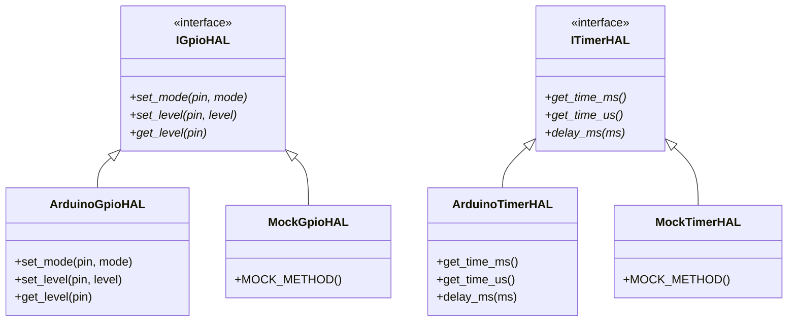

# 🧺 From Spaghetti to Clean Embedded C++: The Washing Machine Case Study

> A deep-dive engineering log documenting the architectural refactoring of a real-world domestic appliance firmware: transitioning from a monolithic legacy Arduino prototype into a modern, test-driven, decoupled embedded C++ architecture.

---

## 📑 Table of Contents
1. [Introduction & Background](#introduction--background)
2. [Chapter 1: Deconstructing the Legacy Codebase (v0.1.0)](#chapter-1-deconstructing-the-legacy-codebase-v010)
3. [Chapter 2: Hardware Abstraction & Dependency Injection](#chapter-2-hardware-abstraction--dependency-injection)
4. [Chapter 3: Host Unit Testing with GoogleTest, Google Mock & Automated CI](#chapter-3-host-unit-testing-with-googletest-google-mock--automated-ci)
5. [Chapter 4: Actuator Safety, Motor Dead-Time & Interlocks *(In Progress)*](#chapter-4-actuator-safety-motor-dead-time--interlocks)
6. [Chapter 5: Event-Driven Non-Blocking State Machine (FSM) *(Upcoming)*](#chapter-5-event-driven-non-blocking-state-machine-fsm)
7. [Chapter 6: Hardware Portability & Next-Gen Peripherals (ESP32-C3 & I2C) *(Upcoming)*](#chapter-6-hardware-portability--next-gen-peripherals-esp32-c3--i2c)

---

## Introduction & Background

In 2017, a domestic washing machine suffered a catastrophic failure of its proprietary electronic control board. Rather than discarding the machine, the electronics were reverse-engineered and replaced with an **ATmega328P microcontroller board (Arduino Pro Mini, 5V, 16MHz)** driving TRIACs and power relays.

The initial prototype proved that open-source hardware could successfully breathe new life into household machinery. However, written as a quick single-file `.ino` sketch, the code carried significant technical debt.

This case study documents the transformation of that monolithic prototype into a **production-grade, testable, object-oriented embedded C++ system**.

---

## Chapter 1: Deconstructing the Legacy Codebase (v0.1.0)

Before refactoring, we analyzed the code smells and architectural bottlenecks in [`washing-machine.ino`](../washing-machine.ino):

### 1. The Monolithic `.ino` Anti-Pattern
All domain logic, hardware pin assignments, timing loops, UI debouncers, and safety timeouts lived in a single 800+ line file. Modifying one feature (e.g. adjusting agitation speed) risked breaking unrelated subsystems (e.g. water fill detection).

### 2. Blocking `delay()` and `while()` Traps
The firmware relied heavily on blocking loops:
```cpp
// Legacy blocking agitation loop:
while (now() <= tempoAvanco) {
    digitalWrite(motorDir, HIGH);
    delay(300);
    digitalWrite(motorDir, LOW);
    delay(200); // Motor dead-time
    digitalWrite(motorEsq, HIGH);
    delay(300);
    digitalWrite(motorEsq, LOW);
    delay(200);
}
```
**Why this is dangerous:** While the processor is stuck inside a `delay()` call, the CPU is 100% blind. It cannot monitor safety sensors, process emergency button presses, read accelerometer vibration interrupts, or update visual indicators smoothly.

### 3. Global Mutable State
Variables like `seletorPrograma`, `usaAmaciante`, `estadoChaveNivelB`, and `erro` were global. Any function could modify any state without validation, making the system prone to race conditions and difficult to reason about.

### 4. Zero Automated Testability
Because the code directly called Arduino hardware functions (`digitalRead`, `digitalWrite`, `pinMode`), it was impossible to run on a PC. Every test required uploading to physical hardware and waiting real minutes for cycles to complete.

---

## Chapter 2: Hardware Abstraction & Dependency Injection

To make the codebase testable and portable, we established the **Hardware Abstraction Layer (HAL)**.



### Key Design Decisions:

1. **Pure Abstract Interfaces:**
   - [`src/hal/interfaces/i_gpio_hal.hpp`](../src/hal/interfaces/i_gpio_hal.hpp): Encapsulates pin direction and digital I/O.
   - [`src/hal/interfaces/i_timer_hal.hpp`](../src/hal/interfaces/i_timer_hal.hpp): Encapsulates system timestamp services (`millis`, `micros`).

2. **Constructor Dependency Injection via References (`&`):**
   Classes receive their dependencies as C++ references:
   ```cpp
   Button(hal::IGpioHAL& gpio_hal,
          hal::ITimerHAL& timer_hal,
          uint8_t pin,
          const ButtonConfig& config = ButtonConfig{});
   ```
   - **Guaranteed Non-Null:** Eliminates null pointer checks.
   - **Zero Heap Overhead:** No dynamic allocation (`new`/`malloc`/`shared_ptr`), critical for 2 KB SRAM microcontrollers.

3. **Macro Collision Avoidance:**
   Legacy Arduino headers define `#define HIGH 0x1`, `#define INPUT 0x0`. To prevent the C preprocessor from corrupting modern C++ `enum class` declarations, enum values use explicit scoped names: `hal::GpioMode::MODE_INPUT`, `hal::GpioLevel::LEVEL_HIGH`.

---

## Chapter 3: Host Unit Testing with GoogleTest, Google Mock & Automated CI

Embedded software does not have to be tested exclusively on target hardware. Adopting **Dual-Target Development** allows 95% of business logic and state machines to be verified on the developer's workstation in milliseconds.

### 1. The Finite State Machine `Button` Driver
We created a robust, non-blocking [`ui::Button`](../src/ui/button.hpp) driven by a 6-state FSM:
- **`WAIT_FOR_PRESS`**: Idle waiting for active level.
- **`DEBOUNCE_PRESS`**: Filters electrical noise glitches (< 20 ms).
- **`WAIT_FOR_RELEASE`**: Measures press duration (distinguishing single click, long press > 1000 ms, and very long press > 3000 ms).
- **`DEBOUNCE_RELEASE`**: Confirms clean release.
- **`WAIT_FOR_DOUBLE`**: 300 ms window to detect double clicks.
- **`TIMEOUT_WAIT_FOR_RELEASE`**: Protects against physically stuck buttons (> 6000 ms).

### 2. Google Mock Verification (`test/test_button.cpp`)
Using Google Mock (`MOCK_METHOD`, `EXPECT_CALL`, `ON_CALL`), we simulate exact electrical waveforms and time steps:

```cpp
TEST_F(ButtonTest, DetectsSingleClickAfterDebounceAndRelease) {
    // 1. Press and hold for 100 ms (past 20ms debounce)
    press_button();
    run_for(100);

    EXPECT_TRUE(btn.is_pressed());
    EXPECT_EQ(btn.get_last_click(), ui::ButtonClickType::NONE_CLICK);

    // 2. Release and wait past double-click window (> 300ms)
    release_button();
    run_for(350);

    EXPECT_FALSE(btn.is_pressed());
    EXPECT_EQ(btn.get_last_click(), ui::ButtonClickType::CLICK);
}
```

### 3. Continuous Integration (GitHub Actions)
We configured [`.github/workflows/ci.yml`](../.github/workflows/ci.yml) with automatic caching (`actions/cache@v4`):
- **On every push:** GoogleTest and Google Mock compile and run all unit tests in **~1 ms**.
- **Firmware build:** `arduino-cli` compiles the full ATmega328P target binary in **~10 s**.

---

## Chapter 4: Actuator Safety, Motor Dead-Time & Interlocks
*(Coming next: Implementing software interlocks to prevent simultaneous motor direction firing and enforced dead-time before TRIAC reversal).*

---

## Chapter 5: Event-Driven Non-Blocking State Machine (FSM)
*(Coming soon: Replacing blocking delay loops with a tick-driven finite state machine).*

---

## Chapter 6: Hardware Portability & Next-Gen Peripherals (ESP32-C3 & I2C)
*(Coming soon: Integrating I2C vibration watchdog and addressable RGB LEDs).*
