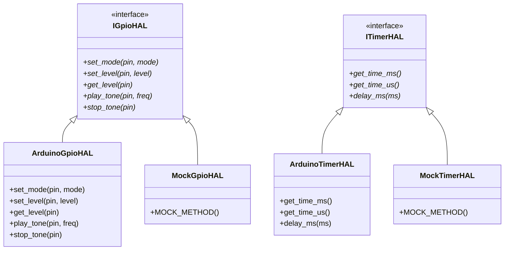
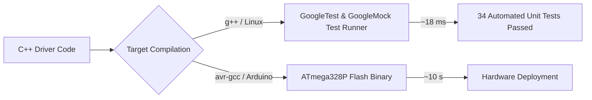
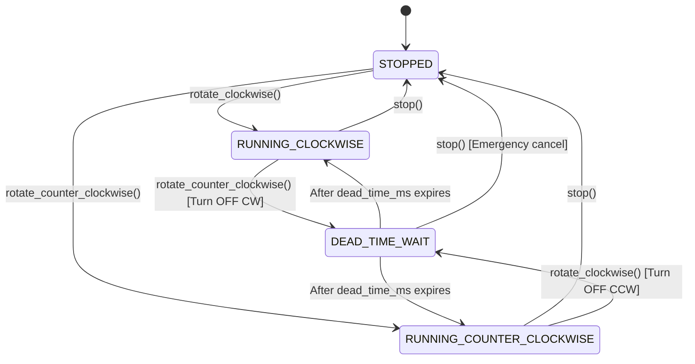

# 🧺 From Spaghetti to Clean Embedded C++: The Washing Machine Case Study

> A deep-dive engineering log documenting the architectural refactoring of a real-world domestic appliance firmware: transitioning from a monolithic legacy Arduino prototype into a modern, test-driven, decoupled embedded C++ architecture.

---

## 📑 Table of Contents
1. [Introduction & Background](#introduction--background)
2. [Chapter 1: Deconstructing the Legacy Codebase (v0.1.0)](#chapter-1-deconstructing-the-legacy-codebase-v010)
3. [Chapter 2: Hardware Abstraction & Dependency Injection](#chapter-2-hardware-abstraction--dependency-injection)
4. [Chapter 3: Dual-Target Development with GoogleTest, Google Mock & Automated CI](#chapter-3-dual-target-development-with-googletest-google-mock--automated-ci)
5. [Chapter 4: Actuator Safety, Motor Dead-Time & Peripheral Drivers](#chapter-4-actuator-safety-motor-dead-time--peripheral-drivers)
6. [Chapter 5: Domain Modeling & Atomic Process Controllers (SRP)](#chapter-5-domain-modeling--atomic-process-controllers-srp)
7. [Chapter 6: Event-Driven Wash Cycle Coordinator FSM *(Upcoming)*](#chapter-6-event-driven-wash-cycle-coordinator-fsm)
8. [Chapter 7: Safety Watchdogs, Fail-Safe Timeouts & I2C Vibration *(Upcoming)*](#chapter-7-safety-watchdogs-fail-safe-timeouts--i2c-vibration)
9. [Chapter 8: WS2812B Addressable LED Engine & Hardware Migration (ESP32-C3) *(Upcoming)*](#chapter-8-ws2812b-addressable-led-engine--hardware-migration-esp32-c3)

---

## Introduction & Background

In 2017, a domestic washing machine suffered a catastrophic failure of its proprietary electronic control board. Rather than discarding the machine, the electronics were reverse-engineered and replaced with an **ATmega328P microcontroller board (Arduino Pro Mini, 5V, 16MHz)** driving TRIACs and power relays.

The initial prototype proved that open-source hardware could successfully breathe new life into household machinery. However, written as a quick single-file `.ino` sketch, the code carried significant technical debt.

This case study documents the transformation of that monolithic prototype into a **production-grade, testable, object-oriented embedded C++ system**.

---

## Chapter 1: Deconstructing the Legacy Codebase (v0.1.0)

Before refactoring, we analyzed the code smells and architectural bottlenecks in [`washing-machine.ino`](../washing-machine.ino):

### 1. The Monolithic `.ino` Anti-Pattern
All domain logic, hardware pin assignments, timing loops, UI debouncers, and safety timeouts lived in a single 800+ line file. Modifying one feature (e.g. adjusting agitation speed) risked breaking unrelated subsystems (e.g. water fill detection).

### 2. Blocking `delay()` and `while()` Traps
The firmware relied heavily on blocking loops:
```cpp
// Legacy blocking agitation loop:
while (now() <= tempoAvanco) {
    digitalWrite(motorDir, HIGH);
    delay(300);
    digitalWrite(motorDir, LOW);
    delay(200); // Motor dead-time
    digitalWrite(motorEsq, HIGH);
    delay(300);
    digitalWrite(motorEsq, LOW);
    delay(200);
}
```
**Why this is dangerous:** While the processor is stuck inside a `delay()` call, the CPU is 100% blind. It cannot monitor safety sensors, process emergency button presses, read accelerometer vibration interrupts, or update visual indicators smoothly.

### 3. Global Mutable State
Variables like `seletorPrograma`, `usaAmaciante`, `estadoChaveNivelB`, and `erro` were global. Any function could modify any state without validation, making the system prone to race conditions and difficult to reason about.

### 4. Zero Automated Testability
Because the code directly called Arduino hardware functions (`digitalRead`, `digitalWrite`, `pinMode`), it was impossible to run on a PC. Every test required uploading to physical hardware and waiting real minutes for cycles to complete.

---

## Chapter 2: Hardware Abstraction & Dependency Injection

To make the codebase testable and portable, we established the **Hardware Abstraction Layer (HAL)**.



### Key Design Decisions:

1. **Pure Abstract Interfaces:**
   - [`src/hal/interfaces/i_gpio_hal.hpp`](../src/hal/interfaces/i_gpio_hal.hpp): Encapsulates pin direction, digital I/O, and hardware tone generation.
   - [`src/hal/interfaces/i_timer_hal.hpp`](../src/hal/interfaces/i_timer_hal.hpp): Encapsulates system timestamp services (`millis`, `micros`).

2. **Constructor Dependency Injection via References (`&`):**
   Classes receive their dependencies as C++ references:
   ```cpp
   Button(hal::IGpioHAL& gpio_hal,
          hal::ITimerHAL& timer_hal,
          uint8_t pin,
          const ButtonConfig& config = ButtonConfig{});
   ```
   - **Guaranteed Non-Null:** Eliminates null pointer checks.
   - **Zero Heap Overhead:** No dynamic allocation (`new`/`malloc`/`shared_ptr`), critical for 2 KB SRAM microcontrollers.

3. **Macro Collision Avoidance:**
   Legacy Arduino headers define `#define HIGH 0x1`, `#define INPUT 0x0`. To prevent the C preprocessor from corrupting modern C++ `enum class` declarations, enum values use explicit scoped names: `hal::GpioMode::MODE_INPUT`, `hal::GpioLevel::LEVEL_HIGH`.

---

## Chapter 3: Dual-Target Development with GoogleTest, Google Mock & Automated CI

Rather than postponing testing to a late milestone, we adopted **Dual-Target Development** directly in `v0.2.0`. Every driver and state machine is verified on the host machine in milliseconds.



### 1. The Finite State Machine `Button` Driver
We created a robust, non-blocking [`ui::Button`](../src/ui/button.hpp) driven by a 6-state FSM:
- **`WAIT_FOR_PRESS`**: Idle waiting for active level.
- **`DEBOUNCE_PRESS`**: Filters electrical noise glitches (< 20 ms).
- **`WAIT_FOR_RELEASE`**: Measures press duration (distinguishing single click, long press > 1000 ms, and very long press > 3000 ms).
- **`DEBOUNCE_RELEASE`**: Confirms clean release.
- **`WAIT_FOR_DOUBLE`**: 300 ms window to detect double clicks.
- **`TIMEOUT_WAIT_FOR_RELEASE`**: Protects against physically stuck buttons (> 6000 ms).

### 2. Automated Continuous Integration (GitHub Actions)
We configured [`.github/workflows/ci.yml`](../.github/workflows/ci.yml) with automatic caching (`actions/cache@v4`):
- **Host Tests:** Native GoogleTest and Google Mock compile and run all unit tests in **~18 ms**.
- **AVR Build:** `arduino-cli` compiles the full ATmega328P target binary in **~10 s**.

---

## Chapter 4: Actuator Safety, Motor Dead-Time & Peripheral Drivers

Controlling high-power AC inductive loads (wash motor, drain pump, brake clutch, solenoid valves) and user interface peripherals requires strict safety interlocks.



### 1. General Binary Loads: `DigitalOutput` & Intrusive Linked List
Single-pin binary actuators (inlet valves, drain pump, clutch actuator) are controlled via [`hal::DigitalOutput`](../src/hal/digital_output.hpp):
- **Intrusive Linked List Pattern:** Objects register themselves into a static linked list during construction without using dynamic memory (`new` / `malloc` / `std::vector`), allowing global batch operations (`DigitalOutput::init_all()`, `DigitalOutput::turn_off_all()`).
- **Active-Low vs Active-High Support:** Seamlessly drives direct-logic outputs and inverted relay modules.
- **Safety Decision (Exclusion of `turn_on_all`):** Turning on all physical loads simultaneously in an appliance (filling valves, heater, pump, and spin motor at once) could cause power surges or domestic breaker trips. Thus, only batch *turn-off* (`turn_off_all()`) is supported for fail-safe emergency shutdowns.

### 2. Bidirectional AC Motor: `ReversibleMotor`
A reversible AC induction motor possesses two independent windings (Clockwise / Right and Counter-Clockwise / Left). Energizing both windings simultaneously creates a violent phase short-circuit across the TRIACs/relays.

[`hal::ReversibleMotor`](../src/hal/reversible_motor.hpp) enforces safety through software:
1. **Mutual Exclusion:** Before setting either direction pin to active level, the opposing direction pin is unconditionally forced to `LEVEL_LOW`.
2. **Non-Blocking Dead-Time:** When reversing from Clockwise to Counter-Clockwise (or vice-versa), both pins are immediately de-energized, and the driver enters `DEAD_TIME_WAIT`. The new direction is energized only after the configured dead-time window (e.g. 200 ms) has elapsed.
3. **Emergency Stop Override:** Calling `stop()` during a dead-time window immediately aborts the pending rotation, ensuring the motor stays safely stopped.

### 3. Water Level Sensing: `PressureSwitchSensor`
The physical electromechanical pressure switch features mixed contact topologies:
- **Low Level (31-32):** Normally Closed (NC) $\rightarrow$ opens under pressure (`LEVEL_HIGH` when level reached).
- **Medium Level (11-13):** Normally Open (NO) $\rightarrow$ closes under pressure (`LEVEL_LOW` when level reached).
- **High Level (21-23):** Normally Open (NO) $\rightarrow$ closes under pressure (`LEVEL_LOW` when level reached).

[`hal::PressureSwitchSensor`](../src/hal/pressure_switch_sensor.hpp) normalizes these raw polarities and implements a **100 ms hydraulic stabilization filter** (*sloshing debouncer*) to prevent false triggering from water waves.

### 4. Non-Blocking Audio: `Buzzer` (Passive Transducer Engine)
The appliance uses a passive piezoelectric transducer without an internal oscillator. [`ui::Buzzer`](../src/ui/buzzer.hpp) utilizes non-blocking 3000 Hz hardware tone generation (`play_tone` / `stop_tone`) to produce acoustic cues:
- `SHORT_BEEP` (50 ms button click feedback)
- `DOUBLE_BEEP` (function toggle)
- `CYCLE_FINISHED` (4-beep completion tune)
- `ERROR_ALARM` (continuous alternating alarm)

### 5. Decoupled Visual Feedback: `ILedPanel` & `DiscreteLedPanel`
To allow transitioning to addressable RGB LEDs (WS2812B) in the future without modifying domain logic, [`ui::ILedPanel`](../src/ui/interfaces/i_led_panel.hpp) provides a semantic visual interface (`set_stage(WashStage)`, `set_selected_level(WaterLevel)`, `set_softener(bool)`). The current implementation [`ui::DiscreteLedPanel`](../src/ui/discrete_led_panel.hpp) drives the 7 physical panel LEDs.

---

## Chapter 5: Domain Modeling & Atomic Process Controllers (SRP)

As the project moved toward cycle orchestration, we confronted a critical architectural decision: how to coordinate complex physical actions (filling, agitating, draining, spinning) without creating an unmaintainable monolithic "God Class".


### 1. Eliminating Coupling Inversion with Domain Types
In early prototypes, enums like `WashProgram` and `WashStage` were defined in `i_led_panel.hpp`, and `WaterLevel` was in `i_water_level_sensor.hpp`. This inverted dependency forced central business logic to include UI and sensor headers.

We extracted all core concepts into [`src/domain/wash_types.hpp`](../src/domain/wash_types.hpp) in namespace `domain`. The domain is now completely pure: HAL, UI, and business logic depend solely on the domain model.

### 2. Deconstructing the "God Class" via SRP
Rather than handling solenoid timings, motor reversals, and drain timeouts inside one massive coordinator, each physical operation was isolated into an **Atomic Process Controller** with a unified lifecycle:

| Controller | Single Responsibility | Key Features |
| :--- | :--- | :--- |
| [`FillController`](../src/controllers/fill_controller.hpp) | Tub water intake | Controls main/softener solenoids; 12-min fail-safe timeout; `pause()` freezes timeout counter. |
| [`Agitator`](../src/controllers/agitator.hpp) | Mechanical fabric wash | 300 ms ON / 200 ms OFF stroke alternation; non-blocking CW/CCW reversal; preserves progress on `pause()`. |
| [`DrainController`](../src/controllers/drain_controller.hpp) | Water evacuation | Controls pump; detects empty tub; executes 30-sec residual water bleeding; 6-min timeout; `pause()` freezes bleeding. |
| [`SpinController`](../src/controllers/spin_controller.hpp) | Centrifugal water extraction | 5s clutch engagement; volume-based sprints; 4s ON / 4s OFF duty cycle; non-blocking transmission protection. |

### 3. Deep-Dive: Top-Load Transmission Mechanics & Inertia Management
Domestic top-load washing machine transmissions (e.g. Whirlpool/Brastemp/Consul) have unique mechanical constraints:
- **Agitation Mode (Actuator OFF):** A heavy spring clamps the brake band onto the outer tub campana, keeping the tub stationary while the central shaft freely oscillates the agitator.
- **Spin Mode (Actuator ON):** The electromechanical actuator pulls a mechanical arm, opening the brake band and meshing the ratchet clutch teeth. The entire drum spins at 700+ RPM.

#### The "Violent Brake-Snap" Trap:
If electrical power to the pump/actuator is cut while the drum is spinning at full speed, the brake spring instantly snaps the brake band onto the steel drum. This produces a loud mechanical crash ("tranco"), severely wearing the brake lining, straining the belt, and risking tooth shear on the plastic clutch came.

#### The Software Solution: Non-Blocking `COAST_DOWN` Protection
In [`SpinController`](../src/controllers/spin_controller.hpp), both normal cycle completion, `pause()`, and `stop()` pass through a 10-second `COAST_DOWN` phase:
1. Power to the motor is cut immediately.
2. The drain pump/actuator **remains energized** for 10 seconds, allowing the drum to decelerate smoothly through air resistance and natural friction.
3. Only when the drum has settled does the controller de-energize the actuator, letting the brake engage quietly without mechanical shock.

#### Rotational Inertia Duty Cycle (4s ON / 4s OFF):
Continuous spin does not energize the single-phase AC induction motor non-stop. After the initial sprint ramp-down, it runs a **4000 ms ON / 4000 ms OFF** duty cycle. The high rotational momentum ($J \cdot \omega$) keeps the basket spinning at extraction velocity while cutting thermal load and electrical consumption by 50%.

### 4. Dual-Target Test Growth
With atomic process controllers, each physical action is tested independently with GoogleTest & GoogleMock:
- `FillControllerTest` (6 tests): level cut-off, timeout detection, valve control, pause/resume.
- `AgitatorTest` (4 tests): CW/CCW alternation, off-pause timing, duration completion, pause/resume.
- `DrainControllerTest` (5 tests): empty detection, 30s bleed phase, timeout detection, pause/resume.
- `SpinControllerTest` (7 tests): clutch engage, level-dependent sprints, 4s/4s duty run, coast-down, soft pause, soft stop, emergency stop.

**Total Host Tests:** **58 tests passing in ~18 ms**.

---

## Chapter 6: Event-Driven Wash Cycle Coordinator FSM *(Upcoming)*
*(Coming next: Orchestrating the 4 wash programs [Normal, Heavy, Rinse, Spin] by sequencing the atomic process controllers).*

---

## Chapter 7: Safety Watchdogs, Fail-Safe Timeouts & I2C Vibration *(Upcoming)*
*(Coming soon: Real-time I2C accelerometer out-of-balance detection and hardware watchdogs).*

---

## Chapter 8: WS2812B Addressable LED Engine & Hardware Migration (ESP32-C3) *(Upcoming)*
*(Coming soon: NeoPixel animation engine and porting to 32-bit ESP32-C3 architecture).*
