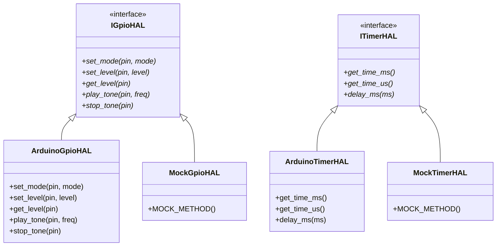
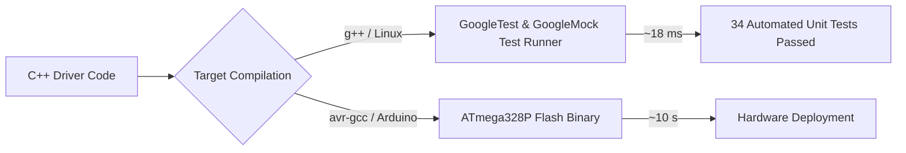
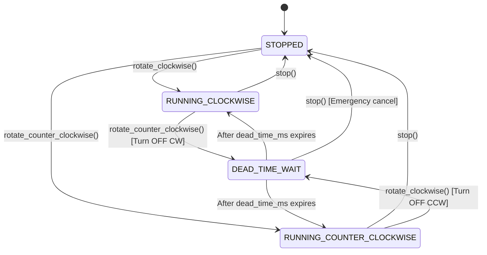
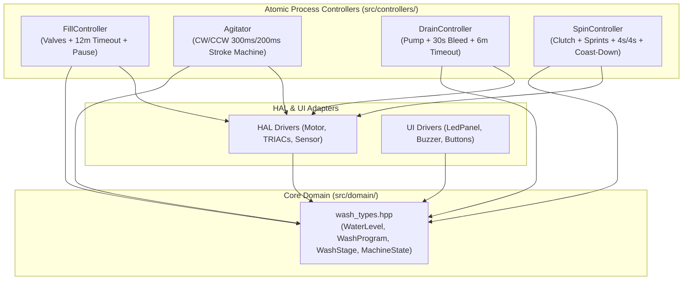
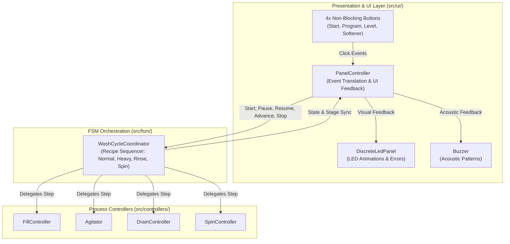

# 🧺 From Spaghetti to Clean Embedded C++: The Washing Machine Case Study

> A deep-dive engineering log documenting the architectural refactoring of a real-world domestic appliance firmware: transitioning from a monolithic legacy Arduino prototype into a modern, test-driven, decoupled embedded C++ architecture.

---

## 📑 Table of Contents
1. [Introduction & Background](#introduction--background)
2. [Chapter 1: Deconstructing the Legacy Codebase (v0.1.0)](#chapter-1-deconstructing-the-legacy-codebase-v010)
3. [Chapter 2: Hardware Abstraction & Dependency Injection](#chapter-2-hardware-abstraction--dependency-injection)
4. [Chapter 3: Dual-Target Development with GoogleTest, Google Mock & Automated CI](#chapter-3-dual-target-development-with-googletest-google-mock--automated-ci)
5. [Chapter 4: Actuator Safety, Motor Dead-Time & Peripheral Drivers](#chapter-4-actuator-safety-motor-dead-time--peripheral-drivers)
6. [Chapter 5: Domain Modeling & Atomic Process Controllers (SRP)](#chapter-5-domain-modeling--atomic-process-controllers-srp)
7. [Chapter 6: Event-Driven Wash Cycle Coordinator FSM & Clean UI Architecture](#chapter-6-event-driven-wash-cycle-coordinator-fsm--clean-ui-architecture)
8. [Chapter 7: The WS2812B Addressable LED Engine, Hardware Re-spin & The AVR Interrupt Collision Dilemma](#chapter-7-the-ws2812b-addressable-led-engine-hardware-re-spin--the-avr-interrupt-collision-dilemma)
9. [Chapter 8: The Autonomous Safety Net - Hardware Watchdog, MPU-6050 Accelerometer, and Two-Tier Dynamic Anti-Walking Spin Control](#chapter-8-the-autonomous-safety-net---hardware-watchdog-mpu-6050-accelerometer-and-two-tier-dynamic-anti-walking-spin-control)
10. [Chapter 9: Hardware Migration to 32-bit Architecture (ESP32-C3) *(Upcoming)*](#chapter-9-hardware-migration-to-32-bit-architecture-esp32-c3)

---

## Introduction & Background

In 2017, a domestic washing machine suffered a catastrophic failure of its proprietary electronic control board. Rather than discarding the machine, the electronics were reverse-engineered and replaced with an **ATmega328P microcontroller board (Arduino Pro Mini, 5V, 16MHz)** driving TRIACs to switch power to the motor, pumps, etc.

The initial prototype proved that open-source hardware could successfully breathe new life into household machinery. However, written as a quick single-file `.ino` sketch, the code carried significant technical debt.

This case study documents the transformation of that monolithic prototype into a **production-grade, testable, object-oriented embedded C++ system**.

---

## Chapter 1: Deconstructing the Legacy Codebase (v0.1.0)

Before refactoring, we analyzed the code smells and architectural bottlenecks in [`washing-machine.ino`](../washing-machine.ino):

### 1. The Monolithic `.ino` Anti-Pattern
All domain logic, hardware pin assignments, timing loops, UI debouncers, and safety timeouts lived in a single 800+ line file. Modifying one feature (e.g. adjusting agitation speed) risked breaking unrelated subsystems (e.g. water fill detection).

### 2. Blocking `delay()` and `while()` Traps
The firmware relied heavily on blocking loops:
```cpp
// Legacy blocking agitation loop:
while (now() <= tempoAvanco) {
    digitalWrite(motorDir, HIGH);
    delay(300);
    digitalWrite(motorDir, LOW);
    delay(200); // Motor dead-time
    digitalWrite(motorEsq, HIGH);
    delay(300);
    digitalWrite(motorEsq, LOW);
    delay(200);
}
```
**Why this is dangerous:** While the processor is stuck inside a `delay()` call, the CPU is 100% blind. It cannot monitor safety sensors, process emergency button presses, read accelerometer vibration interrupts, or update visual indicators smoothly.

### 3. Global Mutable State
Variables like `seletorPrograma`, `usaAmaciante`, `estadoChaveNivelB`, and `erro` were global. Any function could modify any state without validation, making the system prone to race conditions and difficult to reason about.

### 4. Zero Automated Testability
Because the code directly called Arduino hardware functions (`digitalRead`, `digitalWrite`, `pinMode`), it was impossible to run on a PC. Every test required uploading to physical hardware and waiting real minutes for cycles to complete.

---

## Chapter 2: Hardware Abstraction & Dependency Injection

To make the codebase testable and portable, we established the **Hardware Abstraction Layer (HAL)**.



### Key Design Decisions:

1. **Pure Abstract Interfaces:**
   - [`src/hal/interfaces/i_gpio_hal.hpp`](../src/hal/interfaces/i_gpio_hal.hpp): Encapsulates pin direction, digital I/O, and hardware tone generation.
   - [`src/hal/interfaces/i_timer_hal.hpp`](../src/hal/interfaces/i_timer_hal.hpp): Encapsulates system timestamp services (`millis`, `micros`).

2. **Constructor Dependency Injection via References (`&`):**
   Classes receive their dependencies as C++ references:
   ```cpp
   Button(hal::IGpioHAL& gpio_hal,
          hal::ITimerHAL& timer_hal,
          uint8_t pin,
          const ButtonConfig& config = ButtonConfig{});
   ```
   - **Guaranteed Non-Null:** Eliminates null pointer checks.
   - **Zero Heap Overhead:** No dynamic allocation (`new`/`malloc`/`shared_ptr`), critical for 2 KB SRAM microcontrollers.

3. **Macro Collision Avoidance:**
   Legacy Arduino headers define `#define HIGH 0x1`, `#define INPUT 0x0`. To prevent the C preprocessor from corrupting modern C++ `enum class` declarations, enum values use explicit scoped names: `hal::GpioMode::MODE_INPUT`, `hal::GpioLevel::LEVEL_HIGH`.

---

## Chapter 3: Dual-Target Development with GoogleTest, Google Mock & Automated CI

Rather than postponing testing to a late milestone, we adopted **Dual-Target Development** directly in `v0.2.0`. Every driver and state machine is verified on the host machine in milliseconds.



### 1. The Finite State Machine `Button` Driver
We created a robust, non-blocking [`ui::Button`](../src/ui/button.hpp) driven by a 6-state FSM:
- **`WAIT_FOR_PRESS`**: Idle waiting for active level.
- **`DEBOUNCE_PRESS`**: Filters electrical noise glitches (< 20 ms).
- **`WAIT_FOR_RELEASE`**: Measures press duration (distinguishing single click, long press > 1000 ms, and very long press > 3000 ms).
- **`DEBOUNCE_RELEASE`**: Confirms clean release.
- **`WAIT_FOR_DOUBLE`**: 300 ms window to detect double clicks.
- **`TIMEOUT_WAIT_FOR_RELEASE`**: Protects against physically stuck buttons (> 6000 ms).

### 2. Automated Continuous Integration (GitHub Actions)
We configured [`.github/workflows/ci.yml`](../.github/workflows/ci.yml) with automatic caching (`actions/cache@v4`):
- **Host Tests:** Native GoogleTest and Google Mock compile and run all unit tests in **~18 ms**.
- **AVR Build:** `arduino-cli` compiles the full ATmega328P target binary in **~10 s**.

---

## Chapter 4: Actuator Safety, Motor Dead-Time & Peripheral Drivers

Controlling high-power AC inductive loads (wash motor, drain pump, brake clutch, solenoid valves) and user interface peripherals requires strict safety interlocks.



### 1. General Binary Loads: `DigitalOutput` & Intrusive Linked List
Single-pin binary actuators (inlet valves, drain pump, clutch actuator) are controlled via [`hal::DigitalOutput`](../src/hal/digital_output.hpp):
- **Intrusive Linked List Pattern:** Objects register themselves into a static linked list during construction without using dynamic memory (`new` / `malloc` / `std::vector`), allowing global batch operations (`DigitalOutput::init_all()`, `DigitalOutput::turn_off_all()`).
- **Active-Low vs Active-High Support:** Seamlessly drives direct-logic outputs and inverted relay modules.
- **Safety Decision (Exclusion of `turn_on_all`):** Turning on all physical loads simultaneously in an appliance (filling valves, heater, pump, and spin motor at once) could cause power surges or domestic breaker trips. Thus, only batch *turn-off* (`turn_off_all()`) is supported for fail-safe emergency shutdowns.

### 2. Bidirectional AC motor: `ReversibleMotor`
A reversible AC induction motor possesses two directional windings (Clockwise / Right and Counter-Clockwise / Left). Energizing both windings simultaneously produces opposing magnetic fluxes that mechanically lock the rotor in a stall. In this stalled condition (zero back-EMF), both windings draw locked-rotor current simultaneously (exceeding $10\times$ nominal operating current), causing violent acoustic humming, rapid thermal overload of the motor insulation, and destructive stress on the driving power TRIACs.

[`hal::ReversibleMotor`](../src/hal/reversible_motor.hpp) enforces safety through software:
1. **Mutual Exclusion:** Before setting either direction pin to active level, the opposing direction pin is unconditionally forced to `LEVEL_LOW`.
2. **Non-Blocking Dead-Time:** When reversing from Clockwise to Counter-Clockwise (or vice-versa), both pins are immediately de-energized, and the driver enters `DEAD_TIME_WAIT`. The new direction is energized only after the configured dead-time window (e.g. 200 ms) has elapsed.
3. **Emergency Stop Override:** Calling `stop()` during a dead-time window immediately aborts the pending rotation, ensuring the motor stays safely stopped.

### 3. Water Level Sensing: `PressureSwitchSensor`
The physical electromechanical pressure switch features mixed contact topologies:
- **Low Level (31-32):** Normally Closed (NC) $\rightarrow$ opens under pressure (`LEVEL_HIGH` when level reached).
- **Medium Level (11-13):** Normally Open (NO) $\rightarrow$ closes under pressure (`LEVEL_LOW` when level reached).
- **High Level (21-23):** Normally Open (NO) $\rightarrow$ closes under pressure (`LEVEL_LOW` when level reached).

[`hal::PressureSwitchSensor`](../src/hal/pressure_switch_sensor.hpp) normalizes these raw polarities and implements a **100 ms hydraulic stabilization filter** (*sloshing debouncer*) to prevent false triggering from water waves.

### 4. Non-Blocking Audio: `Buzzer` (Passive Transducer Engine)
The appliance uses a passive piezoelectric transducer without an internal oscillator. [`ui::Buzzer`](../src/ui/buzzer.hpp) utilizes non-blocking 3000 Hz hardware tone generation (`play_tone` / `stop_tone`) to produce acoustic cues:
- `SHORT_BEEP` (50 ms button click feedback)
- `DOUBLE_BEEP` (function toggle)
- `CYCLE_FINISHED` (4 loud, repetitive finish beeps to alert from afar)
- `ERROR_ALARM` (continuous alternating alarm)

### 5. Decoupled Visual Feedback: `ILedPanel` & `DiscreteLedPanel`
To allow transitioning to addressable RGB LEDs (WS2812B) in the future without modifying domain logic, [`ui::ILedPanel`](../src/ui/interfaces/i_led_panel.hpp) provides a semantic visual interface (`set_stage(WashStage)`, `set_selected_level(WaterLevel)`, `set_softener(bool)`). The current implementation [`ui::DiscreteLedPanel`](../src/ui/discrete_led_panel.hpp) drives the 7 physical panel LEDs.

---

## Chapter 5: Domain Modeling & Atomic Process Controllers (SRP)

As the project moved toward cycle orchestration, we confronted a critical architectural decision: how to coordinate complex physical actions (filling, agitating, draining, spinning) without creating an unmaintainable monolithic "God Class".



### 1. Eliminating Coupling Inversion with Domain Types
In early prototypes, enums like `WashProgram` and `WashStage` were defined in `i_led_panel.hpp`, and `WaterLevel` was in `i_water_level_sensor.hpp`. This inverted dependency forced central business logic to include UI and sensor headers.

We extracted all core concepts into [`src/domain/wash_types.hpp`](../src/domain/wash_types.hpp) in namespace `domain`. The domain is now completely pure: HAL, UI, and business logic depend solely on the domain model.

### 2. Deconstructing the "God Class" via SRP
Rather than handling solenoid timings, motor reversals, and drain timeouts inside one massive coordinator, each physical operation was isolated into an **Atomic Process Controller** with a unified lifecycle:

| Controller | Single Responsibility | Key Features |
| :--- | :--- | :--- |
| [`FillController`](../src/controllers/fill_controller.hpp) | Tub water intake | Controls main/softener solenoids; 12-min fail-safe timeout; `pause()` freezes timeout counter. |
| [`Agitator`](../src/controllers/agitator.hpp) | Mechanical fabric wash | 300 ms ON / 200 ms OFF stroke alternation; non-blocking CW/CCW reversal; preserves progress on `pause()`. |
| [`DrainController`](../src/controllers/drain_controller.hpp) | Water evacuation | Controls pump; detects empty tub; executes 30-sec residual water bleeding; 6-min timeout; `pause()` freezes bleeding. |
| [`SpinController`](../src/controllers/spin_controller.hpp) | Centrifugal water extraction | 5s clutch engagement; empirically tuned progressive sprints to overcome resonance oscillations; 4s ON / 4s OFF duty cycle; non-blocking transmission protection. |

### 3. Deep-Dive: Top-Load Transmission Mechanics & Inertia Management
Domestic top-load washing machine transmissions (e.g. Whirlpool/Brastemp/Consul) have unique mechanical constraints:
- **Agitation Mode (Actuator OFF):** A heavy spring clamps the brake band onto the outer tub campana, keeping the tub stationary while the central shaft freely oscillates the agitator.
- **Spin Mode (Actuator ON):** The electromechanical actuator pulls a mechanical arm, opening the brake band and meshing the ratchet clutch teeth. The entire drum spins at 700+ RPM.

#### The "Violent Brake-Snap" Trap:
If electrical power to the pump/actuator is cut while the drum is spinning at full speed, the brake spring instantly snaps the brake band onto the steel drum. This produces a loud mechanical crash, severely wearing the brake lining, straining the belt, and risking tooth shear on the plastic clutch came.

#### The Software Solution: Non-Blocking `COAST_DOWN` Protection
In [`SpinController`](../src/controllers/spin_controller.hpp), both normal cycle completion, `pause()`, and `stop()` pass through a 10-second `COAST_DOWN` phase:
1. Power to the motor is cut immediately.
2. The drain pump/actuator **remains energized** for 10 seconds, allowing the drum to decelerate smoothly through natural friction.
3. Only when the drum has settled does the controller de-energize the actuator, letting the brake engage quietly without mechanical shock.

#### Rotational Inertia Duty Cycle (4s ON / 4s OFF):
Continuous spin does not energize the single-phase AC induction motor non-stop. After the initial sprint ramp-down, it runs a **4000 ms ON / 4000 ms OFF** duty cycle. The high rotational momentum ($J \cdot \omega$) keeps the basket spinning at extraction velocity while cutting thermal load and electrical consumption by 50%.

### 4. Dual-Target Test Growth
With atomic process controllers, each physical action is tested independently with GoogleTest & GoogleMock:
- `FillControllerTest` (6 tests): level cut-off, timeout detection, valve control, pause/resume.
- `AgitatorTest` (4 tests): CW/CCW alternation, off-pause timing, duration completion, pause/resume.
- `DrainControllerTest` (5 tests): empty detection, 30s bleed phase, timeout detection, pause/resume.
- `SpinControllerTest` (7 tests): clutch engage, level-dependent sprints, 4s/4s duty run, coast-down, soft pause, soft stop, emergency stop.
- `WashCycleCoordinatorTest` (8 tests): recipe sequencing, step advancement, error triggers, process delegation.
- `PanelControllerTest` (12 tests): button event handling, UI state transitions, audio feedback, differentiated error diagnostics.

**Total Host Tests:** **80 automated unit tests passing in ~42 ms**.

---

## Chapter 6: Event-Driven Wash Cycle Coordinator & UI Panel Orchestration

With the atomic process controllers established, the final milestone of `v0.3.0` was building the high-level **Orchestrator (FSM Coordinator)** and the **Panel Controller**, tying the entire system together via Dependency Injection.



### 1. The `WashCycleCoordinator` Recipe Sequencer
The [`WashCycleCoordinator`](../src/fsm/wash_cycle_coordinator.hpp) implements the complete laundry recipes without blocking:
- **Normal Wash:** Fill $\rightarrow$ Continuous Agitation (18m) $\rightarrow$ Drain $\rightarrow$ Rinse $\rightarrow$ Spin.
- **Heavy Wash:** Fill $\rightarrow$ Gentle Agitation (8m) $\rightarrow$ Long Soak (20m) $\rightarrow$ Normal Agitation (14m) $\rightarrow$ Drain $\rightarrow$ Rinse $\rightarrow$ Spin.
- **Rinse Only:** Single Rinse (no softener) or Double Rinse with Softener (Fill $\rightarrow$ Agitate $\rightarrow$ Drain $\rightarrow$ Interm Spin $\rightarrow$ Softener Fill $\rightarrow$ Agitate $\rightarrow$ Softener Soak $\rightarrow$ Post Agitate $\rightarrow$ Drain $\rightarrow$ Final Spin).
- **Spin Only:** Drain $\rightarrow$ 30s Bleed $\rightarrow$ Clutch Sprints $\rightarrow$ Continuous 4s/4s Spin $\rightarrow$ Coast-Down.

### 2. The `PanelController` Presentation Layer
The [`PanelController`](../src/ui/panel_controller.hpp) bridges user input with the domain:
- **Zero Polling in Domain:** Translates single clicks, long clicks (step advance), and very long clicks (cycle cancel) into coordinator commands.
- **Differentiated Error Diagnostics (Legacy Restored):**
  - `FILL_TIMEOUT` (12-min inlet fail-safe): Blinks all water level LEDs.
  - `DRAIN_TIMEOUT` (5-min pump fail-safe): Blinks all program stage LEDs.
- **Non-Blocking Visual & Acoustic Feedback:** Synchronizes solid vs blinking power LEDs, stage progress, and tone patterns smoothly.

### 3. Main System Assembly via Inversion of Control (`washing-machine.ino`)
The top-level Arduino sketch contains zero business logic, acting strictly as the **Composition Root**:
```cpp
void setup() {
    // 1. Initialize hardware I/O pins
    // 2. Initialize UI presentation
    panel_ctrl.init();
}

void loop() {
    // Non-blocking tick pump
    btn_start.update();
    btn_program.update();
    btn_water_level.update();
    btn_softener.update();

    coordinator.update();
    panel_ctrl.update();
    led_panel.update();
    buzzer.update();
}
```

### 4. Memory Footprint on ATmega328P (5V, 16MHz)
- **Flash ROM:** 14,976 bytes (**48%** of 30,720 bytes).
- **SRAM:** 721 bytes (**35%** of 2,048 bytes).
- **Dynamic Allocation (`heap`):** 0 bytes (100% static allocation).

---

## Chapter 7: The WS2812B Addressable LED Engine, Hardware Re-spin & The AVR Interrupt Collision Dilemma

With the discrete LED release (`v0.3.1`) validated and archived, the physical control panel (wooden box) presented a compelling mechanical and visual opportunity: replacing the complex harness of 7 discrete through-hole LEDs with a single, compact **9-pixel WS2812B addressable RGB strip**. Discret leds serves well, but the led strip can be controlled with a single pin, saving pins to rearrange buttons and free SDA and SCL pins, enabling us to connect vibration sensor and make this project ready for the next steps.

This upgrade introduced embedded challenges spanning cycle-accurate AVR assembly, real-world analog voltage levels, and timer interrupt collisions.

```
Physical Layout of the 9-Pixel Strip (docs/box.webp):
[ P8 ]       [ P7 ]       [ P6 ]   [ P5 ]   [ P4 ]       [ P3 ]       [ P2 ]   [ P1 ]   [ P0 ]
Softner      Empty        Low      Medium    High         Heavy        Wash     Rinse    Spin
(Rose)       (OFF)       (Cyan)    (Cyan)   (Cyan)       (White)      (White)  (White)  (White)
  ◄────────────────────────────────── Physical Strip Orientation ────────────────────────────── DIN
```

---

### 1. The Zero-Heap 16 MHz AVR Assembly Driver (`Ws2812Strip`)

Standard third-party libraries (like FastLED or Adafruit NeoPixel) bring significant flash overhead, dynamic memory allocations, and monolithic dependencies unsuitable for a safety-critical appliance on an ATmega328P, and is overkill for simple animations we need, in fact, the only animation used is breathing.

We engineered a bespoke, zero-heap hardware driver [`Ws2812Strip`](../src/hal/ws2812_strip.hpp) adhering to Clean Architecture:
- **Static Buffer:** Exactly $9 \times 3 = 27$ bytes in GRB color order. Zero heap allocation (`malloc` free).
- **Nanosecond-Accurate Inline Assembly:** The WS2812B 800 kHz protocol requires strict timing:
  - Bit `0`: 350 ns HIGH followed by 800 ns LOW.
  - Bit `1`: 700 ns HIGH followed by 600 ns LOW.
- **Dynamic Register Mapping:** Rather than hardcoding I/O ports in assembly, the driver dynamically resolves the AVR port address and bitmask at runtime (`portOutputRegister(digitalPinToPort(pin_))` and `digitalPinToBitMask(pin_)`), enabling zero-recompilation pin reassignments.
- **Host Testing Support:** In host mode (`-DHOST_TEST`), the driver logs byte buffers cleanly, enabling unit testing without hardware.

---

### 2. Polimorphic UI Abstraction (`StripLedPanel`)

Thanks to the interface inversion introduced in Chapter 6 ([`ILedPanel`](../src/ui/interfaces/i_led_panel.hpp)), migrating the machine from discrete LEDs to the RGB strip required **zero modifications** to `PanelController` or domain logic.

The [`StripLedPanel`](../src/ui/strip_led_panel.hpp) implements:
- **Multi-Tone Aesthetic:** Water levels glow exclusively in Cyan (`0, 220, 255`), wash stages in Pure White (`255, 255, 255`), and the softener indicator in a pastel rose (`255, 100, 140`).
- **Smooth "Breathing" Animation (2-second Period):** The active running stage oscillates smoothly in brightness, future stages maintain a faint 15% standby glow, finished stages extinguish, and paused states pulse synchronously.
- **Integer-Only Wave Math:** Rather than importing heavy floating-point `sin()` math (which consumes ~1.5 KB of AVR Flash), the breathing animation employs integer-only symmetrical triangle wave math:
  ```cpp
  uint16_t phase = now % 2000;
  uint8_t wave = (phase < 1000) ? (phase * 255) / 1000 : ((2000 - phase) * 255) / 1000;
  ```
- **Isolated Diagnostic Strobe:** Inlet timeout (`FILL_TIMEOUT`) blinks water levels in Red; drain pump timeout (`DRAIN_TIMEOUT`) blinks program stages in Red.

---

### 3. Hardware Re-Spin & The Analog "D13 Pull-Up Trap"

Reorganizing the physical ATmega328P wiring reduced the panel interconnect from 12 messy loose wires to a single **7-conductor ribbon cable** with a shared GND:
- `+5V` (Strip VCC)
- `GND` (Common ground for WS2812 strip and all 4 pushbuttons)
- `D6` (WS2812 DIN data line, direct 0Ω connection)
- `D7 / A3` (Softener button)
- `A0 (Pin 14)` (Program button, with 1kΩ series protection)
- `A1 (Pin 15)` (Start-Pause button, with 1kΩ series protection)
- `A2 (Pin 16)` (Water Level button, with 1kΩ series protection)
- **Freed Pins:** Analog pins **`A4 (SDA)`** and **`A5 (SCL)`** were successfully liberated and reserved for the upcoming I2C accelerometer bus.

#### ⚠️ The D13 Electrical Clamping Trap
During initial board testing, buttons on pins A0, A1, and A2 responded flawlessly, but a button wired to **D13** failed to trigger any clicks despite electrical contact.

**The Root Cause:**
- On Arduino Pro Mini boards, D13 has a surface-mount LED and series resistor tied to GND.
- When configuring D13 with `INPUT_PULLUP`, the weak internal pull-up (~30 kΩ) forms a voltage divider with the onboard LED.
- The forward voltage drop ($V_f$) of the red LED clamps the pin at $\approx 1.8\text{V} - 2.0\text{V}$ when the button is released.
- On an ATmega328P powered at 5V, the minimum HIGH input threshold ($V_{IH}$) is $0.6 \times V_{CC} = \mathbf{3.0\text{V}}$.
- Because 1.8V is well below 3.0V, the digital Schmitt trigger never saw a valid release transition (`LEVEL_HIGH`), keeping the button FSM permanently trapped!
- **Resolution:** Buttons were placed on clean GPIOs without onboard LEDs (A0, A1, A2, A3), while the 1kΩ external series resistors reliably pull the pin down to $V_{pin} \approx 0.16\text{V} \ll 1.5\text{V}$ ($V_{IL}$), providing superior ESD and noise rejection.

---

### 4. The AVR Interrupt Collision Dilemma: Tone vs. CLI

When testing long acoustic beeps, an unexpected audio glitch occurred: the piezo buzzer emitted a stuttering, tremolo buzz rather than a smooth, pure tone.

#### The Analysis:
1. The Arduino `tone()` function configures **Timer 2** in CTC mode to toggle the buzzer pin at 3000 Hz, firing an interrupt every **$166\,\mu\text{s}$**.
2. The WS2812B bit-banging protocol demands zero jitter, requiring interrupts to be completely disabled (`cli()`) during transmission.
3. Transmitting 9 pixels ($9 \times 24\text{ bits} \times 1.25\,\mu\text{s}$) holds interrupts disabled for **$270\,\mu\text{s}$**.
4. Because $270\,\mu\text{s} > 166\,\mu\text{s}$, the Timer 2 interrupt was delayed or missed **50 times every second** (at 50 FPS), audibly modulating the carrier wave with a 50 Hz flutter!

#### The Clean Architectural Solution:
Because WS2812 pixels contain internal latching shift registers, **LEDs do not need continuous data transmission to maintain their state**.

Rather than coupling the Buzzer to the Strip, the **`PanelController`** coordinates UI execution:
```cpp
void PanelController::update()
{
    buzzer_.update();

    // Suppress LED frame pushes during active audio output:
    if (!buzzer_.is_playing()) {
        led_panel_.update();
    }
    ...
```
- While a 50 ms button click beep or repeated loud finish beeps are sounding, frame transmission is paused.
- The human eye cannot perceive a 50 ms pause in a slow 2-second breathing wave, but the human ear instantly perceives the pristine, pure 3000 Hz tone.
- In addition, the strip frame rate was throttled to **30 FPS** (`frame_interval_ms = 33`), reducing the total CPU duty cycle consumed by the WS2812 engine.

---

### 5. Appliance Standby & Wake-Up UX

- **Standby Sleep:** When the cycle completes, the coordinator enters `FINISHED`. The LED strip shuts off completely.
- **Wake-Up on Interaction:** Touching any configuration button (Program, Level, Softener) automatically calls `coordinator.stop_cycle()`, transitioning the machine back to `IDLE` and instantly waking up the LED display with the updated settings.

---

### 6. Milestone Metrics & Readiness (v0.4.0)

| Metric | Legacy v0.1.0 | FSM v0.3.1 (Discrete) | Strip v0.4.0 (WS2812) |
| :--- | :--- | :--- | :--- |
| **Flash ROM** | 7,130 B (23%) | 14,976 B (48%) | **15,822 B (51%)** |
| **Static SRAM** | 358 B (17%) | 721 B (35%) | **821 B (40%)** |
| **Dynamic Heap** | 0 B | 0 B | **0 B (Zero Heap)** |
| **Automated Tests** | 0 tests | 80 tests | **100 tests (100% pass, 30 ms)** |
| **Panel Wires** | 12 loose wires | 12 loose wires | **7-conductor flat ribbon** |
| **Free GPIOs** | 0 pins | 0 pins | **A4/A5 I2C + A6/A7 Free** |

The firmware is now **production-ready and field-tested** for all domestic washing machines with functional mechanical balance.

---

## Chapter 8: The autonomous safety net - hardware watchdog, MPU-6050 accelerometer, and two-tier dynamic anti-walking spin control

With the WS2812B user interface and the liberated I2C bus (A4/A5) firmly established, milestone `v0.5.0` addressed the most demanding mechanical and safety challenges of domestic washing machine control:
1. Guaranteeing system fail-safe resilience against firmware hangs, brownouts, and electromagnetic noise via an AVR hardware watchdog timer.
2. Interfacing a 6-axis MPU-6050 MEMS accelerometer over I2C without third-party library overhead or dynamic memory allocations.
3. Quantifying washing machine drum resonance mechanics and preventing the destructive phenomenon known as "machine walking" during spin acceleration.
4. Implementing a real-time, gravity-immune vibration monitoring engine with dual-tier shock and sustained unbalance trip logic.
5. Creating a coordinated two-tier recovery architecture: dry redistribution retries within `SpinController`, followed by active hydraulic redistribution (water fill, agitation, and drainage) within `WashCycleCoordinator`.
6. Providing seamless user error recovery and resumption from the control panel.

---

### 1. The AVR hardware watchdog and the Optiboot boot-loop trap

In an appliance switching inductive loads (reversing motor, drain pump, and inlet valves) at mains voltage (127V / 220V AC), electrical noise, transient brownouts, or single-event upsets (SEU) can theoretically cause microcontrollers to enter undefined states.

A software-only safety monitor cannot recover from a frozen execution loop. We implemented the [`IWatchdogHAL`](../src/hal/interfaces/i_watchdog_hal.hpp) interface and [`ArduinoWatchdogHAL`](../src/hal/arduino/arduino_watchdog_hal.hpp), wrapping the native AVR watchdog library (`<avr/wdt.h>`).

#### The ATmega328P watchdog reset loop dilemma
On AVR architectures, a watchdog reset has a critical quirk: after the reset vector executes, the Watchdog Timer remains enabled in hardware with the shortest possible prescaler (~15 ms timeout).

If the microcontroller runs a standard bootloader or executes extensive C++ static initializers, the 15 ms timeout expires before `main()` can be reached. The chip then resets repeatedly in an infinite, unrecoverable boot loop (watchdog reset storm).

#### The architectural solution (`.init3` early initialization)
To eliminate this failure mode definitively, the watchdog must be disabled before global C++ variable constructors execute. We implemented an early initialization hook mapped directly into the AVR compiler's `.init3` section:

```cpp
#ifdef __AVR__
#include <avr/wdt.h>

// Disable watchdog immediately after reset before C runtime initialization:
void early_watchdog_disable(void) __attribute__((naked, section(".init3")));
void early_watchdog_disable(void)
{
    MCUSR = 0;
    wdt_disable();
}
#endif
```

During normal operation, the watchdog is configured with a 2-second timeout window and kicked on every cycle of the non-blocking `loop()` tick pump:
```cpp
void loop() {
    watchdog.kick();
    ...
```
If any controller blocks or hangs for more than 2 seconds, the hardware watchdog forcibly reboots the microcontroller safely into `IDLE`.

---

### 2. Zero-allocation MPU-6050 accelerometer driver over I2C

With analog pins `A4` (SDA) and `A5` (SCL) liberated during the ribbon cable hardware re-spin (Chapter 7), we integrated an MPU-6050 6-axis MEMS accelerometer directly onto the washing machine drum assembly.

Standard third-party MPU-6050 libraries (such as Adafruit or I2Cdevlib) introduce multi-kilobyte flash overhead, heavy dynamic math routines, and blocking delays. Adhering strictly to Clean Architecture, we engineered:
1. [`II2cHAL`](../src/hal/interfaces/i_i2c_hal.hpp) and [`ArduinoI2cHAL`](../src/hal/arduino/arduino_i2c_hal.hpp): A thin hardware abstraction layer wrapping the Arduino `Wire` library, providing clean mockability in host unit tests (`MockI2cHAL`).
2. [`Mpu6050`](../src/hal/mpu6050.hpp): A dedicated, zero-heap hardware driver:
   - **Device Wake-Up:** Clears the sleep bit in `PWR_MGMT_1` (`0x6B = 0x00`).
   - **Dynamic Range Selection:** Configures `ACCEL_CONFIG` (`0x1C = 0x08`) for $\pm 4g$ full-scale sensitivity ($8192\text{ LSB}/g$), perfectly suited for washing machine acceleration dynamics.
   - **Hardware Digital Low Pass Filter (DLPF):** Configures `CONFIG` (`0x1A = 0x03`) for a 44 Hz cutoff frequency. This hardware filter attenuates high-frequency motor commutator noise, and acoustic vibrations while preserving structural drum oscillation.
   - **Fast Burst Read:** Reads all 6 raw accelerometer data bytes (`0x3B` to `0x40`) in a single continuous I2C transaction, maximizing bus efficiency.

---

### 3. Empirical vibration telemetry and the mechanics of "machine walking"

During spin acceleration, a top-loading or front-loading washing machine must extract large volumes of water from sodden clothing. When wet fabrics clump asymmetrically on one side of the drum, centrifugal forces create an eccentric rotating mass vector:

$$F_{\text{unbalance}} = m_{\text{offset}} \cdot r \cdot \omega^2$$

As drum rotational speed ($\omega$) increases, this force passes through the mechanical resonance frequency of the suspension springs and dampers (typically between 150 RPM and 350 RPM drum speed, or ~600 to 1400 motor RPM).

#### The failure of continuous linear acceleration
In early firmware revisions, a continuous ramp or abrupt duty cycle caused severe mechanical resonance during water extraction. Telemetry from empirical field trials (Tests 1 through 10) revealed dramatic transverse oscillations exceeding 12,000 LSB ($\approx 1.5g$). When sustained, these vibrations forced the suspension dampers to bottom out against the chassis, producing violent thumping and causing the entire appliance to "walk" across the floor.

#### The tailored 4-stage progressive sprint ramp
To overcome this structural barrier, we developed and empirically validated a tailored 4-stage sprint ramp schedule ([`k_default_sprints`](../src/controllers/spin_controller.hpp)):

```
Motor State
   ▲
ON │   ┌──┐    ┌───┐    ┌────┐    ┌─────┐    ┌──────────────── Continuous Duty
   │   │  │    │   │    │    │    │     │    │
OFF└───┴──┴────┴───┴────┴────┴────┴─────┴────┴───────────────► Time
     Sp.1: 4.0s  Sp.2: 5.0s  Sp.3: 6.0s  Sp.4: 7.0s
     Off:  3.5s  Off:  3.5s  Off:  4.0s  Off:  3.0s
```

1. **Sprint 1 (4.0s ON / 3.5s OFF):** Brief rotation pulse that expels standing water through the perforations without allowing drum velocity to settle inside the dangerous 200 RPM resonance band.
2. **Sprint 2 (5.0s ON / 3.5s OFF):** Intermediate pulse that compresses wet garments firmly against the drum wall, redistributing centrifugal mass before full speed is applied.
3. **Sprint 3 (6.0s ON / 4.0s OFF):** High-torque extraction pulse expelling the majority of absorbed water weight.
4. **Sprint 4 (7.0s ON / 3.0s OFF):** Final stabilizing pulse ensuring balance before engaging continuous high-speed spinning.

Field test 11 demonstrated that this stepped sprint schedule suppressed resonance oscillations by over 60%, completely eliminating chassis walking.

---

### 4. The `VibrationMonitor` engine: rolling peak-to-peak and dynamic gravity cancellation

To detect unbalance automatically, we created the [`VibrationMonitor`](../src/controllers/vibration_monitor.hpp) component implementing [`IVibrationMonitor`](../src/controllers/interfaces/i_vibration_monitor.hpp).

#### Mathematical elimination of static gravity
Accelerometers measure both dynamic acceleration and static gravitational acceleration ($1g$). Furthermore, appliances rarely sit on perfectly level floors, introducing an unknown static tilt component on X and Y axes.

Traditional approaches attempt static offset calibration at boot or floating-point trigonometric tilt compensation, consuming precious CPU cycles and flash memory.

Instead, the `VibrationMonitor` evaluates a **rolling peak-to-peak amplitude window ($V_{p-p}$)** sampled at 50 Hz (`20 ms` interval) across a 200 ms rolling buffer (10 samples):

$$V_{p-p} = \max_{t \in [T - 200\text{ms}, T]}(A[t]) - \min_{t \in [T - 200\text{ms}, T]}(A[t])$$

Because the static gravitational component $g_{\text{static}}$ is constant over any short window:

$$V_{p-p} = (\max(A_{\text{dynamic}}) + g_{\text{static}}) - (\min(A_{\text{dynamic}}) + g_{\text{static}}) = \max(A_{\text{dynamic}}) - \min(A_{\text{dynamic}})$$

The static gravity vector and installation tilt cancel out completely and intrinsically, with zero calibration routines and zero floating-point math!

#### Dual-tier trip thresholds
The monitor monitors transverse drum plane motion ($\max(V_{p-p, X}, V_{p-p, Y})$) against two distinct safety criteria:
1. **Severe Shock Trip ($V_{p-p} \ge 14,000$ LSB / $\approx 1.7g$):** An immediate, zero-latency trip triggered on single-sample impact detection, protecting against sudden mechanical obstruction or violent tub impact.
2. **Sustained Warning Trip ($V_{p-p} \ge 11,000$ LSB / $\approx 1.34g$):** Requires vibration to remain above the threshold continuously for at least $1.0\text{ second}$. This filters out harmless transient spikes (such as temporary wet clothing flips) while reliably tripping on sustained, rhythmic out-of-balance rotation.

---

### 5. Two-tier autonomous unbalance recovery architecture

Rather than immediately alarming and halting the wash cycle when an unbalance occurs, modern smart appliances attempt to rectify the load distribution automatically. We implemented a hierarchical, two-tier recovery strategy across `SpinController` and `WashCycleCoordinator`:

```
                    ┌────────────────────────────┐
                    │      Active Spin Cycle     │
                    │  (Sprints or Continuous)   │
                    └─────────────┬──────────────┘
                                  │ Vibration Trip
                                  ▼
               ┌──────────────────────────────────────┐
               │    Tier 1: Dry Redistribution        │
               │    (SpinController Internal)         │
               └──────────────────┬───────────────────┘
                                  │
                   Dry Retries < max (Default 1)?
                     ├── YES ──► Stop motor, enter RETRY_COASTING (10s),
                     │           pump ON, reset monitor, restart sprints
                     │
                     └── NO (Dry Retries Exhausted)
                           │
                           ▼
               ┌──────────────────────────────────────┐
               │    Tier 2: Hydraulic Redistribution  │
               │    (WashCycleCoordinator FSM)        │
               └──────────────────┬───────────────────┘
                                  │
               Hydraulic Retries < max (Default 1)?
                 ├── YES ──► Freeze main recipe (step_index_)
                 │           1. RECOVERY_FILL: Fill to LOW_LEVEL (float clothes)
                 │           2. RECOVERY_AGITATE: Agitate 30s (untangle load)
                 │           3. RECOVERY_DRAIN: Drain with smooth handover
                 │           4. Restart Spin Cycle with fresh dry retries!
                 │
                 └── NO (All Retries Exhausted)
                       │
                       ▼
         ┌───────────────────────────────────────────┐
         │     Latch MachineError::UNBALANCED_LOAD   │
         │     Blink Red Spin LED & Sound Alarm      │
         └───────────────────────────────────────────┘
```

#### Tier 1: Dry redistribution in `SpinController`
When `VibrationMonitor` reports critical unbalance during active rotation:
- The motor is immediately de-energized.
- The controller enters `RETRY_COASTING`, maintaining the drain pump active for 10 seconds to allow the drum to decelerate smoothly to 0 RPM.
- The vibration monitor is reset.
- The controller re-engages the mechanical clutch and restarts the sprint ramp from Sprint 1. Often, the gentle deceleration and re-acceleration allows clothes to settle into a better balance without consuming water.
- Up to `max_unbalance_retries` (default: 1) are performed.

#### Tier 2: Active hydraulic redistribution in `WashCycleCoordinator`
If all dry retries fail, `SpinController` flags `has_error_ = true`. The coordinator intercepts this state before triggering an alarm:
- The recipe step index (`step_index_`) is frozen in place, preserving all cycle progress and program settings.
- The UI stage indicator remains as `WashStage::SPIN`, ensuring the user sees that the machine is actively resolving the spin phase.
- The coordinator executes an autonomous 3-step hydraulic sub-routine:
  1. `RECOVERY_FILL`: Fills the tub with water strictly up to `WaterLevel::LOW_LEVEL`, regardless of the program's overall water level setting. Adding water allows the sodden, tightly packed laundry to detach from the drum walls and float freely.
  2. `RECOVERY_AGITATE`: Engages the agitator for 30 seconds (`unbalance_agitate_sec`), physically churning and redistributing the floating garments symmetrically across the tub.
  3. `RECOVERY_DRAIN`: Engages the drain pump to empty the water, performing a seamless handover directly back to the spin cycle.
- The spin cycle is re-initialized with fresh dry retries.
- Only if the load remains critically unbalanced after hydraulic redistribution does the machine finally latch `MachineError::UNBALANCED_LOAD`.

---

### 6. User error resumption and panel interaction

When an error condition does occur (`UNBALANCED_LOAD`, `FILL_TIMEOUT`, or `DRAIN_TIMEOUT`), the system provides clean, intuitive operator recovery:

- **Diagnostic Strobe:** The LED strip illuminates the fault source in bright Red (blinking Pixel 8 for unbalance, water level pixels for fill timeout, program pixels for drain timeout) while sounding the acoustic alarm.
- **Single-Click Resumption:** After rectifying the physical issue (e.g. opening the water tap or untangling bulky blankets), the user presses the **Start/Pause** button once. The coordinator:
  1. Clears error flags across all sub-controllers (`reset_error()`).
  2. Restores `MachineState::RUNNING` and `MachineError::NONE`.
  3. Re-executes the interrupted step (`execute_step(current_step_)`) without losing recipe position, stage progress, or configured options.
- **Very Long-Click Cancellation:** Holding Start/Pause for more than 3 seconds cancels the cycle, stops all actuators, and returns the appliance safely to `MachineState::IDLE`.

---

### 7. Milestone Metrics & Readiness (v0.5.0)

| Metric | Legacy v0.1.0 | FSM v0.3.1 (Discrete) | Strip v0.4.0 (WS2812) | Safety & Sensing v0.5.0 |
| :--- | :--- | :--- | :--- | :--- |
| **Flash ROM** | 7,130 B (23%) | 14,976 B (48%) | 15,822 B (51%) | **22,120 B (72%)** |
| **Static SRAM** | 358 B (17%) | 721 B (35%) | 821 B (40%) | **1,383 B (67%)** |
| **Dynamic Heap** | 0 B | 0 B | 0 B | **0 B (Zero Heap)** |
| **Automated Tests** | 0 tests | 80 tests | 100 tests | **138 tests (100% pass, 34 ms)** |
| **Watchdog Protection** | None | None | None | **Hardware AVR WDT (.init3 hook)** |
| **Vibration Sensing** | None | None | None | **I2C MPU-6050 (Dual-tier trip)** |
| **Unbalance Recovery** | None | None | None | **Two-tier (Dry + Hydraulic)** |
| **Free GPIOs** | 0 pins | 0 pins | A4/A5 I2C + A6/A7 Free | **A6/A7 Free (Analog-only)** |

The firmware on the ATmega328P has achieved its ultimate evolution: industrial safety, real-time MEMS dynamics sensing, autonomous physical fault self-healing, and an elegant digital user experience, all operating within 2 KB of RAM without a single byte of dynamic memory allocation.

---

## Chapter 9: Hardware Migration to 32-bit Architecture (ESP32-C3) *(Upcoming)*
*(Coming in future releases: Native FreeRTOS multitasking, telemetry over Wi-Fi/BLE, and migration to modern 32-bit RISC-V silicon).*

