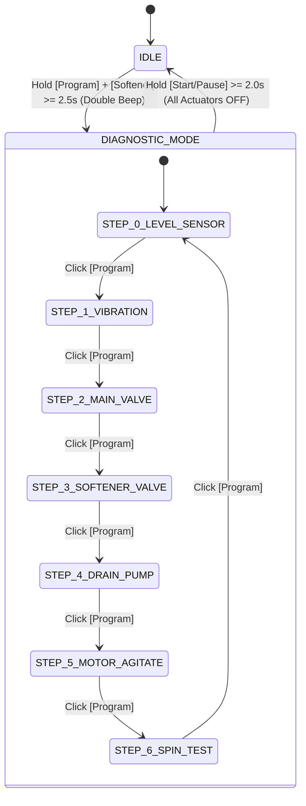

# 🛠️ Field Service & Diagnostic Manual: Washing Machine Custom Controller

> **Target Audience:** Field service technicians, embedded engineers, and assembly personnel.  
> **Firmware Version:** `v0.6.0+`  
> **Hardware Support:** ATmega328P (5V, 16MHz) / Arduino Pro Mini / Discrete LEDs & WS2812B Addressable RGB Strip.

---

## 📑 Table of Contents
1. [Overview & Purpose](#1-overview--purpose)
2. [Operating Modes & Entry/Exit Procedures](#2-operating-modes--entryexit-procedures)
3. [Operator Panel Controls](#3-operator-panel-controls)
4. [Diagnostic Steps Reference (Steps 0 to 6)](#4-diagnostic-steps-reference)
5. [Visual Indicator Mappings (RGB Strip vs. Discrete LEDs)](#5-visual-indicator-mappings)
6. [Hardware Safety Interlocks & Protection](#6-hardware-safety-interlocks--protection)
7. [Field Troubleshooting Guide](#7-field-troubleshooting-guide)

---

## 1. Overview & Purpose

The **Field Service Self-Test Mode (`DiagnosticController`)** provides an integrated, non-intrusive diagnostic routine built into the washing machine firmware.

In standard operation, troubleshooting intermittent electrical or mechanical faults (such as a seized pump, a clogged inlet valve, an unbalance sensor failure, or motor capacitor degradation) requires either complete chassis disassembly or waiting for a 45-minute wash cycle to reproduce the symptom.

The diagnostic routine allows an operator to:
- Test each electromechanical peripheral (valves, pump, clutch, motor windings) individually.
- Read real-time sensor telemetry (linear pressure switch contacts, MPU-6050 accelerometer dynamic amplitude).
- Validate the health of the suspension dampers and drum balance before running loaded cycles.
- Verify hardware TRIAC drivers, relays, and harness integrity in-situ.

---

## 2. Operating Modes & Entry/Exit Procedures



### 2.1 Entering Diagnostic Mode
1. Ensure the washing machine is powered on and in **`IDLE` state** (no cycle running, power LED solid).
2. Press and hold both **[Program]** (`btn_program`) and **[Softener]** (`btn_softener`) pushbuttons simultaneously for at least **2.5 seconds**.
3. The buzzer will emit a distinct confirmation tone (`DOUBLE_BEEP`), and the panel will transition to Step 0 (`LEVEL_SENSOR`).

> [!NOTE]
> Releasing either button before the 2.5-second threshold cancels the entry request without disturbing normal operation.

### 2.2 Exiting Diagnostic Mode
- **Manual Exit:** Press and hold the **[Start/Pause]** (`btn_start`) pushbutton for $\ge 2.0\text{ seconds}$.
- **Fail-Safe Behavior:** Exiting diagnostic mode immediately de-energizes all active solenoids, pumps, and motors (`turn_off_all()`), resets the vibration monitor, and returns the machine safely to the normal `IDLE` state with default program settings.

---

## 3. Operator Panel Controls

When Diagnostic Mode is active, the physical pushbuttons are mapped as follows:

| Pushbutton | Action | Function |
| :--- | :--- | :--- |
| **[Program]** | Single Click | **Next Step:** Advances to the next diagnostic step ($0 \rightarrow 1 \rightarrow 2 \rightarrow 3 \rightarrow 4 \rightarrow 5 \rightarrow 6 \rightarrow 0$). Shuts down active load from previous step. |
| **[Start/Pause]** | Single Click | **Toggle Actuator:** Toggles the selected actuator ON or OFF (e.g. opens/closes valve, starts/stops agitation). |
| **[Start/Pause]** | Long Press ($\ge 2.0\text{s}$) | **Exit Diagnostics:** Shuts off all loads and exits to normal `IDLE`. |
| **[Water Level]** | — | Unused during diagnostics. |
| **[Softener]** | — | Unused during diagnostics. |

---

## 4. Diagnostic Steps Reference

```
Diagnostic Steps Flow:
[ 0. Level Sensor ] ──► [ 1. Vibration Sensor ] ──► [ 2. Main Valve ] ──► [ 3. Softener Valve ]
                                                                                │
[ 0. Level Sensor ] ◄── [ 6. Spin Test ] ◄── [ 5. Motor Agitate ] ◄── [ 4. Drain Pump ]
```

---

### Step 0: Pressure Switch / Water Level Sensor (`LEVEL_SENSOR`)
* **Purpose:** Verifies electromechanical pressure switch contacts and wiring harness in real time.
* **Actuator State:** All actuators remain OFF.
* **Behavior:** The panel continuously displays the real-time water level inside the tub. As water is added manually or blown into the pressure switch hose, the indicator updates dynamically:
  - `EMPTY` $\rightarrow$ No level LEDs illuminated.
  - `LOW_LEVEL` $\rightarrow$ Low level indicator ON.
  - `MEDIUM_LEVEL` $\rightarrow$ Low + Medium level indicators ON.
  - `HIGH_LEVEL` $\rightarrow$ Low + Medium + High level indicators ON.

---

### Step 1: MPU-6050 Accelerometer & Suspension Health (`VIBRATION_SENSOR`)
* **Purpose:** Validates I2C bus communication (`A4/A5`) with the MPU-6050 6-axis MEMS sensor and measures tub dynamic vibration amplitude ($V_{p-p}$).
* **Actuator State:** All actuators remain OFF.
* **Behavior:**
  - **I2C Status:** An active I2C link is indicated in **Green**. If communication fails (disconnected cable, missing pull-ups, or sensor hardware fault), the link indicator turns **Red**.
  - **Live Dynamic VU-Meter:** Gently shaking or knocking the tub will deflect the dynamic LED bar graph in real time across 7 progressive intensity levels (from 400 LSB up to $>14,000$ LSB).

---

### Step 2: Main Detergent Solenoid Valve (`MAIN_VALVE`)
* **Purpose:** Tests water intake solenoids 1 and 2 (wash detergent dispenser) and corresponding TRIAC/relay driver.
* **Operation:** Press **[Start/Pause]** to toggle the valve ON / OFF.
* **Safety Note:** Avoid leaving valves open indefinitely to prevent tub overflow.

---

### Step 3: Softener Solenoid Valve (`SOFTENER_VALVE`)
* **Purpose:** Tests water intake solenoid 3 (fabric softener compartment siphon) and its driver circuit.
* **Operation:** Press **[Start/Pause]** to toggle the valve ON / OFF.

---

### Step 4: Drain Pump & Residual Evacuation (`DRAIN_PUMP`)
* **Purpose:** Tests the drain pump motor, plumbing evacuation, and the mechanical clutch actuation arm.
* **Operation:** Press **[Start/Pause]** to toggle the pump ON / OFF.
* **Telemetry:** Displays real-time water level indicators simultaneously. Technicians can visually observe the water level dropping from `HIGH` down to `EMPTY`.

---

### Step 5: Bidirectional Motor Agitation (`MOTOR_AGITATE`)
* **Purpose:** Validates both Clockwise (CW) and Counter-Clockwise (CCW) motor windings, power TRIACs, starting capacitor, and mechanical agitator spline engagement.
* **Operation:** Press **[Start/Pause]** to start/stop the agitation cycle.
* **Behavior:** Runs the standard alternating agitation stroke cycle (300 ms CW $\rightarrow$ 200 ms dead-time $\rightarrow$ 300 ms CCW $\rightarrow$ 200 ms dead-time). Panel indicators dynamically illuminate in sync with each active rotation direction.

---

### Step 6: Centrifugal Spin & Clutch Engagement (`SPIN_TEST`)
* **Purpose:** Tests high-speed basket extraction, transmission brake band release, mechanical clutch engagement, and vibration trip interlocks.
* **Operation:** Press **[Start/Pause]** to start/stop the spin routine.
* **Safety Interlocks:**
  1. **5-Second Brake Release Delay:** Upon pressing Start, the drain pump/actuator energizes immediately to pull the brake arm. The motor is held de-energized for **5.0 seconds** (`k_spin_clutch_delay_ms`) to ensure the mechanical brake has fully disengaged before rotation begins.
  2. **Active MPU-6050 Vibration Protection:** If transverse tub oscillation exceeds $V_{p-p} \ge 11,000\text{ LSB}$ (or suffers a severe shock $\ge 14,000\text{ LSB}$), the controller **immediately cuts power to the motor and pump**, aborts the test, and latches the red unbalance trip warning.

---

## 5. Visual Indicator Mappings

The user interface abstracts diagnostic rendering through [`ILedPanel::show_diagnostic()`](../src/ui/interfaces/i_led_panel.hpp), supporting both the 9-pixel WS2812B RGB strip and the discrete 7-LED panel.

```
WS2812B 9-Pixel Addressable Strip Layout (Inverted Orientation):
[ P8 ]       [ P7 ]       [ P6 ]   [ P5 ]   [ P4 ]       [ P3 ]       [ P2 ]   [ P1 ]   [ P0 ]
Softener     Low Level    Med Level High Lvl Gap 1       Heavy Wash   Wash     Rinse    Spin
(Far Left)                                                                              (Far Right - DIN)
```

### 5.1 Addressable RGB Strip Panel (`StripLedPanel`)

| Step | Mode Name | Step Marker (Pixel 0 - Far Right) | Active Feature Pixels & Color | Description |
| :---: | :--- | :---: | :--- | :--- |
| **0** | `LEVEL_SENSOR` | **Blue** (`0,0,255`) | **Pixels 7, 6, 5:** Cyan (`0,220,255`) | Pixels 7 (Low), 6 (Med), 5 (High) illuminate according to pressure switch contacts. |
| **1** | `VIBRATION_SENSOR` | **Magenta** (`255,0,255`) | **Pixel 8:** Green (OK) / Red (Fail)<br>**Pixels 7 $\rightarrow$ 1:** Multi-Color VU-Meter | P8 indicates I2C health.<br>P7, P6, P5 (Green $\ge 400, 1500, 3500$ LSB)<br>P4, P3 (Yellow $\ge 6000, 8500$ LSB)<br>P2, P1 (Red $\ge 11000, 14000$ LSB). |
| **2** | `MAIN_VALVE` | **Cyan** (`0,220,255`) | **Pixels 7 & 6:** Cyan | Bright Cyan when main solenoids 1 & 2 are energized; Dim Cyan when OFF. |
| **3** | `SOFTENER_VALVE` | **Cyan** (`0,220,255`) | **Pixel 8:** Pink (`255,100,140`) | Bright Pink when softener solenoid 3 is energized; Dim Pink when OFF. |
| **4** | `DRAIN_PUMP` | **Yellow** (`255,200,0`) | **Pixel 1:** Yellow (Pump Active)<br>**Pixels 7, 6, 5:** Cyan (Real-time Level) | P1 glows Yellow when pump is powered; P7/P6/P5 show real-time water level. |
| **5** | `MOTOR_AGITATE` | **Green** (`0,255,0`) | **Pixel 4:** Green (CW Active)<br>**Pixel 3:** Green (CCW Active) | P4 glows during CW stroke; P3 glows during CCW stroke; both OFF during dead-time. |
| **6** | `SPIN_TEST` | **Red** (`255,0,0`) | **Pixel 2:** Yellow (Pump/Clutch)<br>**Pixel 4:** Red (Motor Spinning)<br>**Pixel 8:** Red (Vibration Tripped) | P2 indicates brake release; P4 indicates active motor rotation; P8 latches Red if unbalance limits are exceeded. |

---

### 5.2 Discrete LED Panel (`DiscreteLedPanel`)

| Step | Mode Name | Step Indicator LED | Active Feature LEDs | Meaning |
| :---: | :--- | :---: | :--- | :--- |
| **0** | `LEVEL_SENSOR` | **Spin** | **Low, Med, High** | Water level LEDs reflect pressure switch state in real time. |
| **1** | `VIBRATION_SENSOR` | **Rinse** | **Softener:** I2C Status<br>**Low, Med, High:** Mini VU-Meter | Softener ON = I2C OK.<br>Low/Med/High LEDs illuminate progressively on vibration peaks. |
| **2** | `MAIN_VALVE` | **Wash** | **Low + Medium** | Low and Medium level LEDs illuminate when main valve is active. |
| **3** | `SOFTENER_VALVE` | **Wash** | **Softener** | Softener LED illuminates when softener valve is active. |
| **4** | `DRAIN_PUMP` | **Spin** | **Softener:** Pump Active<br>**Low, Med, High:** Level | Softener LED indicates pump powered; Level LEDs reflect current water volume. |
| **5** | `MOTOR_AGITATE` | **Wash** | **Wash:** CCW Stroke<br>**Spin:** CW Stroke | Wash LED reflects CCW torque; Spin LED reflects CW torque. |
| **6** | `SPIN_TEST` | **Spin** | **Rinse:** Clutch / Pump<br>**Wash:** Motor Active<br>**Softener:** Vibration Trip | Rinse indicates brake release; Wash indicates motor rotation; Softener indicates unbalance trip latch. |

---

## 6. Hardware Safety Interlocks & Protection

The diagnostic mode is designed with hardware protection to prevent accidental equipment damage during service:

1. **Anti-Stall Transmission Interlock:**
   Top-load washing machine transmissions require the electromechanical actuator to physically open the spring-loaded brake band before drum rotation can occur. The firmware strictly enforces a **5000 ms clutch delay** in Step 6 before applying AC power to the motor winding.
2. **Dynamic Unbalance Guarding:**
   In manual spin mode, if an unbalanced load is present or suspension springs are broken, the MPU-6050 monitor trips at $V_{p-p} \ge 11,000\text{ LSB}$ ($1.34g$) or $14,000\text{ LSB}$ ($1.7g$ impact). The motor is cut off in $<20\text{ ms}$, preventing tub impact against the chassis.
3. **Emergency Stop & De-energization:**
   Exiting diagnostic mode (long-pressing Start/Pause) executes `DigitalOutput::turn_off_all()` and `motor_.stop()`, guaranteeing no inductive load remains energized unattended.

---

## 7. Field Troubleshooting Guide

| Observed Symptom | Diagnostic Step to Use | Root Cause & Remediation |
| :--- | :---: | :--- |
| **Machine fails to fill / No water intake** | **Step 2 & Step 3** | Toggle valve. If LED illuminates but no water flows: check 127V/220V AC coil resistance (~3.5 kΩ to 4.5 kΩ). If coil is good, inspect water inlet mesh filter or driving TRIAC/relay on control board. |
| **Water fills continuously / Tub overflows** | **Step 0 & Step 2** | If valve remains open when toggled OFF: mechanical valve diaphragm is blocked by sediment. If valve closes but water level reads `EMPTY` when full: check pressure switch air tube for kinks, water condensation, or air leaks at the tub chamber fitting. |
| **Water will not drain** | **Step 4** | Toggle pump. If pump hums but does not pump: check for foreign objects (coins, socks) in impeller. If silent: check pump coil continuity and board wiring. |
| **Motor hums in agitation but does not oscillate** | **Step 5** | Toggle agitation. If motor hums in one direction only: check directional TRIAC or broken wire on that winding. If motor hums in both directions without rotating: check motor starting capacitor (~35 µF to 45 µF) or motor drive belt. |
| **Loud crash / screeching during spin startup** | **Step 6** | The transmission clutch actuator is not disengaging the brake band properly, or the mechanical clutch teeth are worn/misaligned. Check brake band spring tension and actuator stroke. |
| **Vibration sensor LED stays Red in Step 1** | **Step 1** | I2C communication error. Check 4-pin harness to MPU-6050 (VCC, GND, SDA on A4, SCL on A5) and verify 4.7 kΩ I2C pull-up resistors to 5V. |
| **Appliance "walks" or bangs violently during spin** | **Step 1 & Step 6** | Shake tub manually in Step 1 and observe VU-meter. If minor movement causes massive amplitude readings: inspect the 4 suspension rod springs and plastic dampers for wear or loss of damping grease. |

---

*For detailed architectural explanations and design patterns, refer to the [Washing Machine Architecture Case Study](case-study.md).*
